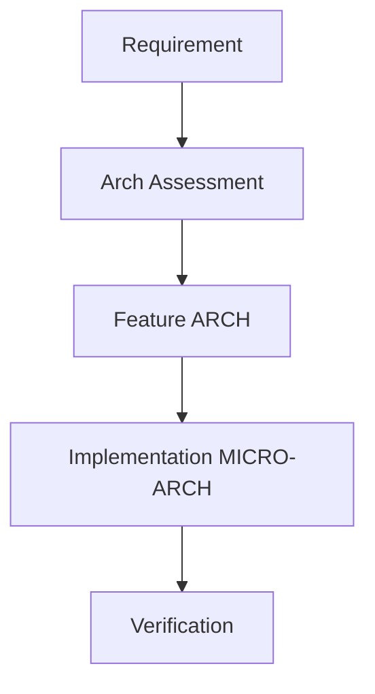

# Quality Control

# Cheat Sheets

1. Cloning tickets from SoC to IP

# Open Source

Contribute publicly relevant developments, e.g. Visual Analysis

# Methodology

## Documentation

## Version Control

## Ticket Management

### Traceability

## Architecture Exploration

## Performance Analysis