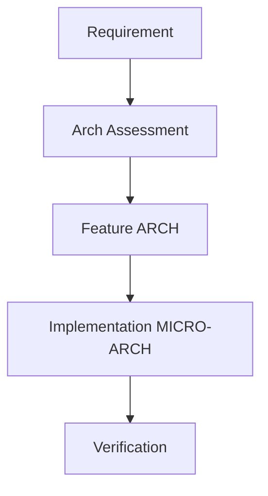

# Quality Control

# Cheat Sheets

1. Cloning tickets from SoC to IP

# Open Source

Contribute publicly relevant developments, e.g. Visual Analysis

# Methodology

## Documentation

## Version Control

## Ticket Management

### Traceability

 * Baseline features and their documents, design + val as graph nodes

 * Delta features and their nodes

Change management, feature prioritization and traceability

## Architecture Exploration

High Level Arch Spec (SystemC, TLM) and auto-synthesize RTL post arch val

## Performance Analysis

## Machine Readable Spec

Single source documentation of spec which is machine readable, and is also used to auto-generate HAS documents / images etc. (spec2diagram, spec2rtl etc.)

## Agile Development

80:20 rule, quick proof of concept, time to market, minimal validation. Define the non-negotiable features, and drive the project with focus only on them, rather than trying to do too many things and making it too complex - instead of prioritizing mask cost, optimize getting something working to the market