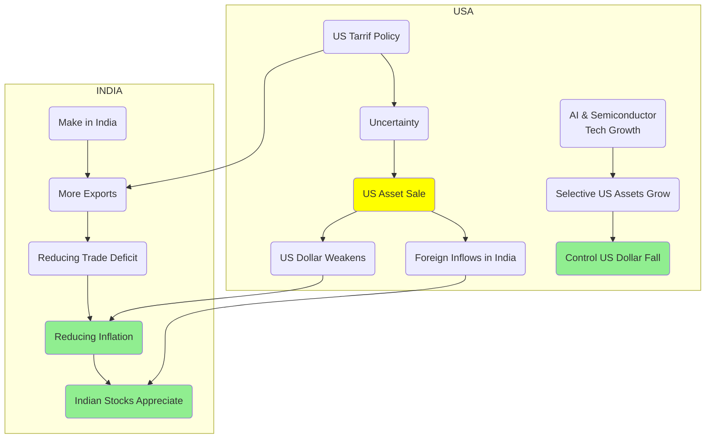

# US Tariff Policy Impact

```mermaid
flowchart
	subgraph USA
		A(US Tarrif Policy) --> B(Uncertainty) --> C(US Asset Sale)
		C --> D(US Dollar Weakens)
		C --> E(Foreign Inflows in India)

		L("AI & Semiconductor<br>Tech Growth") --> M(Selective US Assets Grow) --> N(Control US Dollar Fall)
	end

	style F fill:lightgreen
	style N fill:lightgreen
	style C fill:yellow

	subgraph INDIA
		G(Make in India) --> H(More Exports) --> J(Reducing Trade Deficit)
		J --> K(Reducing Inflation) --> F
		F(Indian Stocks Appreciate)
	end

	D --> K
	E --> F
	A --> H

	style K fill:lightgreen
```